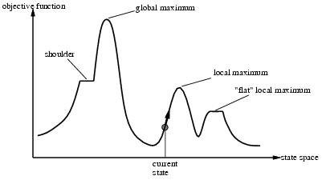

# Local Search
맨 땅에 헤딩하는 방법
fringe : 지금 까지 탐색한 끝부분

Local Search는 현 상태만 기억함

# Hill-climbing Search
- 더 좋은 곳으로만 이동 하다가 더 좋은 곳이 없으면 끝낸다
- "greedy local best search" 라고도 함
- "현재 상태"에서 제일 좋은 곳을 찾음
- local maximum : 제일 좋은 곳에서 끝내는 부분
- 당연히 Optimality 보장이 안됨
    - 하지만, 랜덤으로 시작하는 방법을 여러번 반복하면 Optimal한 부분을 찾을 확률이 높아진다
    - 100%는 절대 되지 않음
    - 8-queens 문제의 경우 31번 정도면 99% Optimality보장이 됨

