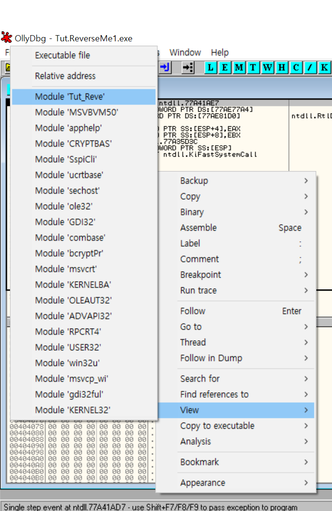
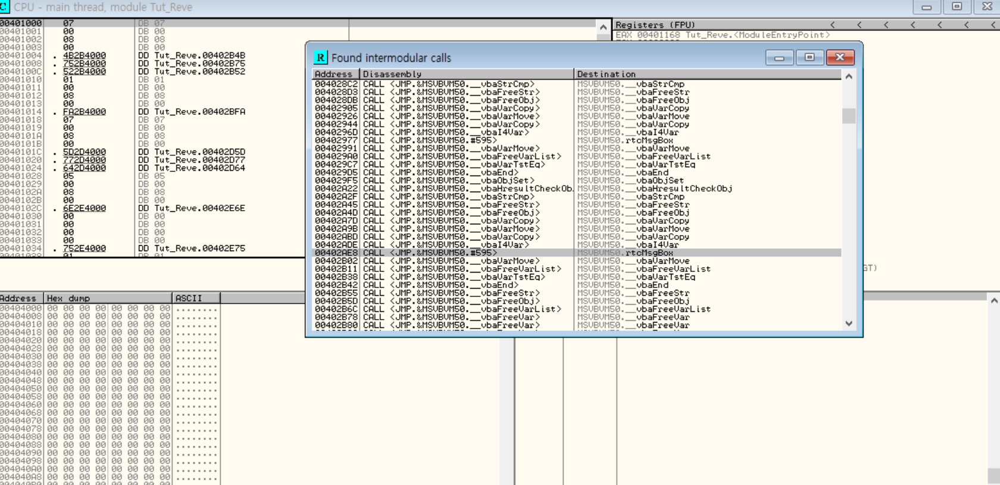
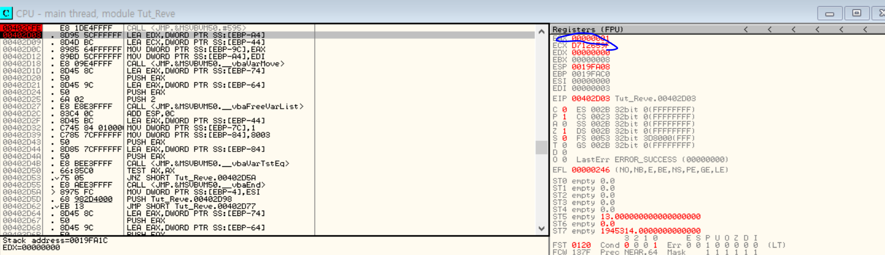
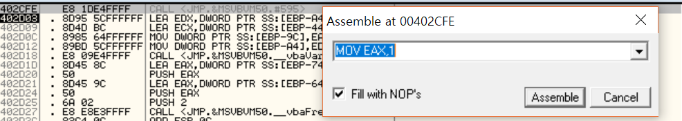
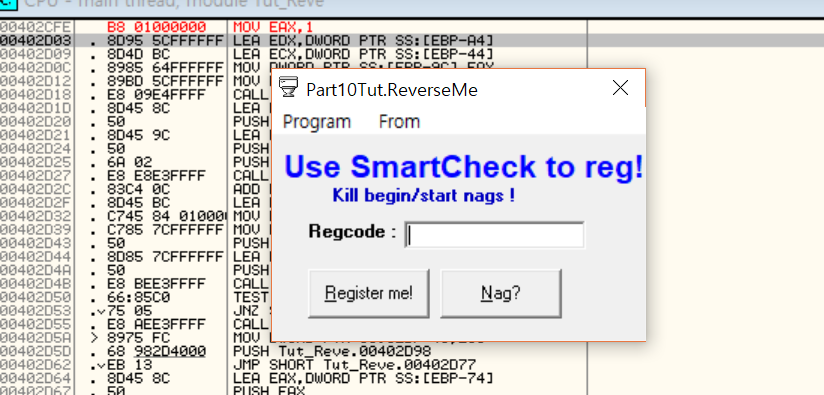
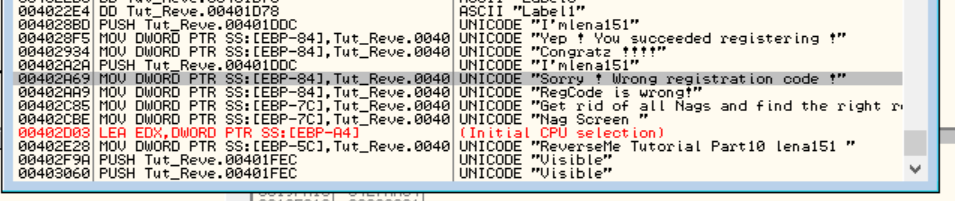
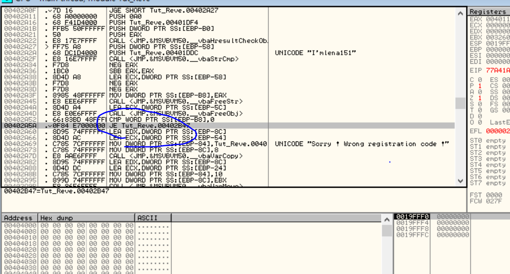
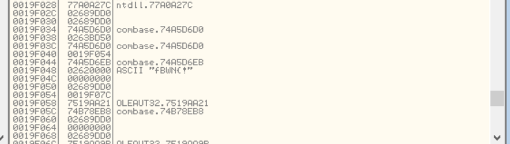
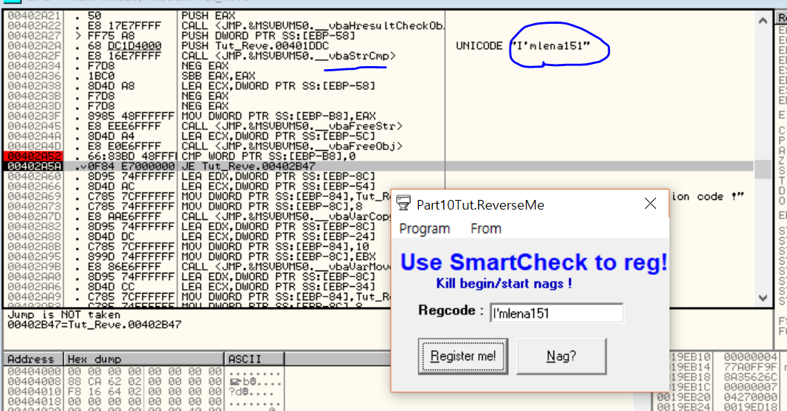

# 컴퓨터 보안 실습과제 보고서
## 2012003909 김승현

과제목표
----
이번과제의 목표는 조교님이 주신 Rena's reversing 응용 프로그램을 리버싱하여 다음을 수행하는 것입니다.
1. 프로그램 실행시 맨 처음에 뜨는 메세지 박스 출력을 없애는 것
2. Registration Code 구하기 ( 우회하는 방법 제외 )

저는 1번 같은 경우 메세지박스 함수 호출하는 부분을 찾아서 아무 일도 일어나지 않도록 고쳐주고

2번 같은 경우 비교하는 부분에서 UNICODE나 Stack에서 찾아내도록 하였습니다

메세지박스 우회
----
ollydbg로 프로그램을 열고 \[View\] - \[Module Tut_Reve\] 메뉴를 이용해서 프로그램의 메인으로 들어갑니다.

그 다음은 메세지박스를 호출 하는 부분을 찾아야 합니다. 이는 \[Search for\] - \[All intermodular calls\] 메뉴를 이용해서 찾을 수 있습니다.

함수 이름중에 '**rtcMsgBox**'라는 메세지박스 호출 함수이름 같은 부분이 보입니다.

**rtcMsgBox**함수 호출 부분으로 가면 CALL 명령어가 보입니다. 저는 처음에 이를 우회하기 위해 **NOP** 명령어로 채워봤으나, 그러면 실행시 다음으로 넘어갈 수가 없습니다.

메세지박스가 예/아니오 입력을 받아서 비교처리를 하기 때문이므로 '예' 버튼을 눌렀을 때의 결과를 알아야 합니다

따라서 rtcMsgBox 호출 후 **다음 구문에 Breakpoints를 걸어서 실행후** '예'버튼을 눌러봅니다.

실행 결과 EAX값이 1으로 바뀐 것을 알 수 있습니다.

따라서 CALL 명령어를 MOV EAX,1 로 설정해주었습니다.

실행결과 메세지박스 출력없이 바로 Registration Code 입력하는 폼으로 넘어가는 것을 볼 수 있습니다.

Registration Code 얻기
----
Registration Code는 생각보다 쉽게 얻을 수 있었습니다. 

모듈의 메인에서 \[Search for\] - \[All referenced text strings\] 을 통해서 모든 문자열을 찾습니다

Registration Code를 잘못 입력 했을 때 뜨는 문구 'Sorry! Wrong registration code!' 부분을 찾아 들어갑니다

코드 위를 올려다보면 의심스러운 CMP,JE 명령어 부분이 있습니다. 저는 처음에 저번 과제와 마찬가지로 저 부분에서 STACK을 보면 답이 있을 거라고 생각하고 Breakpoint로 스택을 보았습니다

의심스러운 문자열 fBWNC! 를 발견했지만 아쉽게도 정답이 아니었습니다.

다시한번 코드를 보았을 때, CMP 부분위에 UNICODE **I'mlena151** 이라는 문자열이 있는 것을 발견했습니다. 이 역시 수상하여 입력해 보았습니다

그 결과 **I'mlena151**이 registration code라는 것을 알게 되었습니다.

